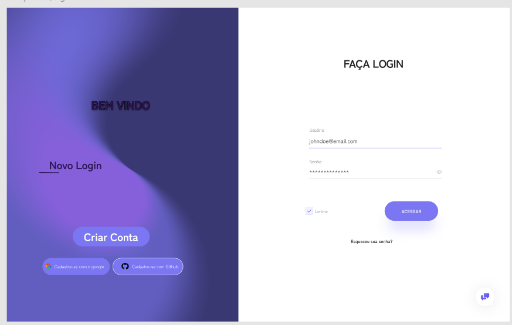
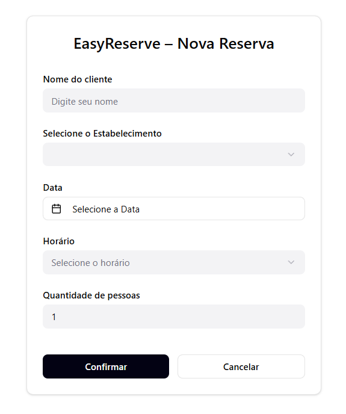
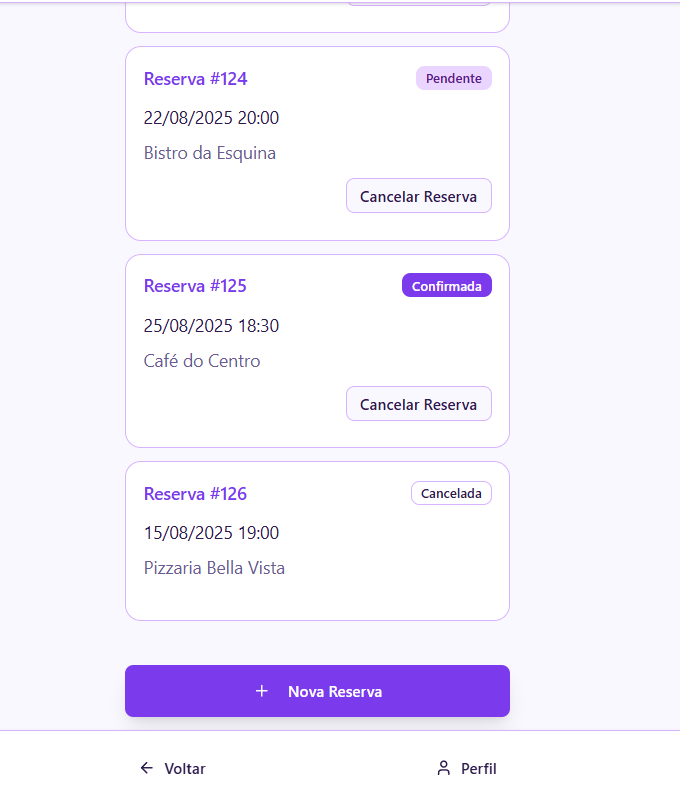
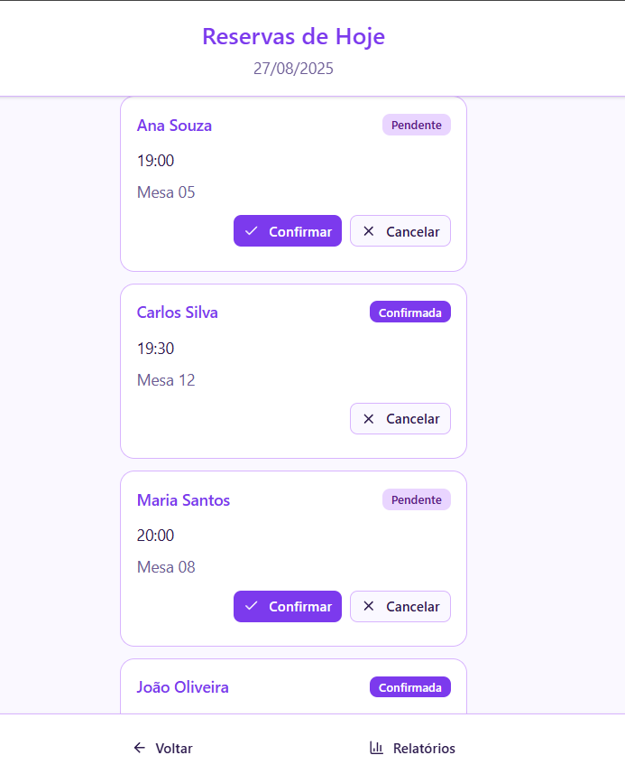

# EasyReserve - Sistema de Reservas para Restaurantes

## 1) Problema
Clientes em restaurantes e eventos têm dificuldade em garantir lugares devido à falta de organização nas reservas.  
Isso gera filas, lotação inesperada, clientes insatisfeitos e perda de oportunidades para os estabelecimentos.  
No início, o foco será em restaurantes locais, com o objetivo de facilitar reservas online de mesas.

## 2) Atores e Decisores (quem usa / quem decide)
- **Usuários principais:** Clientes, Funcionários do restaurante/evento  
- **Decisores/Apoiadores:** Dono/gerente do restaurante, Organizadores de eventos

## 3) Casos de uso (de forma simples)
- **Todos:** Logar/deslogar; manter dados cadastrais  
- **Cliente:** Criar reserva, consultar reservas, cancelar reserva  
- **Funcionário:** Visualizar reservas, confirmar presença, cancelar reserva  
- **Gerente:** Gerar relatórios de ocupação, configurar horários e capacidade

## 4) Limites e suposições
- **Limites:** Entrega final até o prazo da disciplina; rodar no navegador; sem serviços de taxa  
- **Suposições:** Internet disponível; acesso a dispositivos; estabelecimento fornece horários e capacidade  
- **Plano B:** Sem internet → registrar reservas localmente e sincronizar depois; sem tempo do cliente → reserva feita pelo funcionário

## 5) Hipóteses + validação
- **H-Valor:** Se o cliente puder reservar online, a satisfação e a taxa de ocupação aumentam  
  - **Validação (valor):** Testar com 1 restaurante e 10 clientes; sucesso se ≥7 reservas forem concluídas sem ajuda  
- **H-Viabilidade:** Criar e listar reservas leva até 10 segundos no protótipo  
  - **Validação (viabilidade):** Medir em 20 tentativas; meta: pelo menos 18/20 em ≤10 s

## 6) Fluxo principal e primeira fatia
- **Fluxo principal (curto):**  
    1 - Cliente faz login → 2 - Escolhe data/hora → 3 - Reserva mesa/lugar → 4 -- Sistema confirma e mostra resultado
- **Primeira fatia vertical (escopo mínimo):**  
  Inclui: login, criar reserva, salvar no sistema, listar reservas  
  **Critérios de aceite:**  
  - Criar reserva → aparece na lista do cliente  
  - Cancelar reserva → desaparece ou fica marcado como “cancelada”

## 7) Esboços de algumas telas (wireframes)
- Login  
  
- Tela “Nova Reserva” (escolher data e horário)  
  
- Lista de Reservas do Cliente  
  
- Painel do Funcionário (visualizar reservas do dia)  
  

## 8) Tecnologias

### 8.1 Navegador
- **Navegador:** HTML/CSS/JS, Angular  
- **Armazenamento local:** LocalStorage 
- **Hospedagem:** GitHub Pages

### 8.2 Front-end 
- **Front-end:** Angular  
- **Hospedagem:** Vercel

### 8.3 Back-end
**Back-end (API):** Spring Boot (Java)
**Banco de dados:** MySQL
**Deploy do back-end:** Railway

## 9) Plano de Dados (Dia 0) — somente itens 1–3

### 9.1 Entidades
- **Usuario:** Cliente, Funcionário ou Gerente do sistema  
- **Reserva:** Registro de reserva feita pelo cliente  
- **Estabelecimento:** Restaurante ou evento que recebe reservas

### 9.2 Campos por entidade
<!-- Use tipos simples: uuid, texto, número, data/hora, booleano, char. -->

### Usuario
| Campo           | Tipo                          | Obrigatório | Exemplo            |
|-----------------|-------------------------------|-------------|--------------------|
| id              | número                        | sim         | 1                  |
| nome            | texto                         | sim         | "Ana Souza"        |
| email           | texto                         | sim (único) | "ana@exemplo.com"  |
| senha_hash      | texto                         | sim         | "$2a$10$..."       |
| papel           | número (0=aluno, 1=professor) | sim         | 0                  |
| dataCriacao     | data/hora                     | sim         | 2025-08-20 14:30   |
| dataAtualizacao | data/hora                     | sim         | 2025-08-20 15:10   |

### Estabelecimento 
| Campo               | Tipo               | Obrigatório | Exemplo                 |
|-----------------    |--------------------|-------------|-------------------------|
| id                  | número             | sim         | 1                       |
| Nome                | texto              | sim         | "Restaurante1"          |
| Endereco            | texto              | sim         | "rua teste"             |
| HorarioAbertura     | data/hora          | sim         | 2025-08-20 14:35        |
| DataFechamento      | char               | sim         | 2025-08-20 14:35        |
| dataCriacao         | data/hora          | sim         | 2025-08-20 14:50        |
| dataAtualizacao     | data/hora          | sim         | 2025-08-20 14:50        |

### Reserva
| Campo               | Tipo               | Obrigatório | Exemplo                 |
|-----------------    |--------------------|-------------|-------------------------|
| id                  | número             | sim         | 1                       |
| Usuario_id          | número (fk)        | sim         | 1                       |
| estabelecimento_id  | número (fk)        | sim         | 3                       |
| dataHora            | data/hora          | sim         | 2025-08-20 14:35        |
| status              | char               | sim         |a = ativo | c = cancelado|
| dataCriacao         | data/hora          | sim         | 2025-08-20 14:50        |
| dataAtualizacao     | data/hora          | sim         | 2025-08-20 14:50        |

### 9.3 Relações entre entidades
- Um Usuario tem muitas Reservas (1→N)  
- Uma Reserva pertence a um Usuario (N→1)  
- Um Estabelecimento tem muitas Reservas (1→N)  
- Uma Reserva pertence a um Estabelecimento (N→1)

